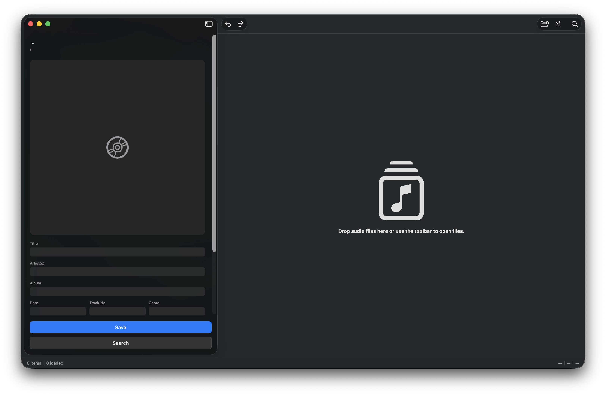
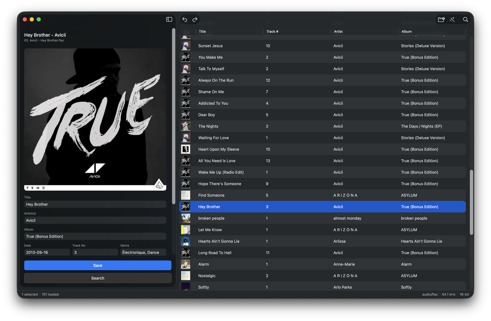
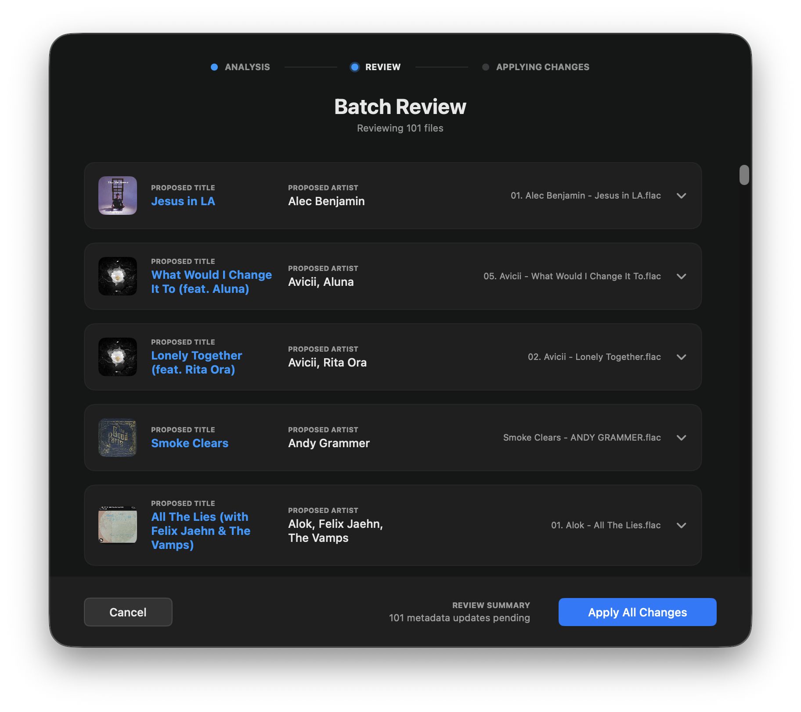

# MusicTagger

<p align="center">
  
</p>

<p align="center">
  A native macOS app for editing music file metadata using Spotify and iTunes.
</p>

Browse your local music library, search Spotify or iTunes for the correct track, and write clean metadata — title, artist, album, artwork, and more — directly to your audio files.

---

## Screenshots

<p align="center">
  
  <br><em>Empty state on first launch</em>
</p>

<p align="center">
  
  <br><em>Browsing a loaded library with metadata editor</em>
</p>

<p align="center">
  
  <br><em>Batch Review — applying metadata to 101 files</em>
</p>

---

## Features

- Import local music files individually or by folder (recursive, up to 2 levels deep)
- View and edit existing file tags — title, artist, album, track number, disc number, genre, composer, artwork, and more
- Search **Spotify** or **iTunes** to auto-fill metadata for a selected file
- Batch mode: search and apply metadata to multiple files in parallel, with a review step before committing
- Undo/redo support for all edits including batch operations
- Embed album artwork directly into audio files — accepts local image files or remote URLs
- Artwork is fetched at full resolution (up to 3000×3000) from iTunes
- Supports FLAC, MP3, AAC, M4A, and WAV via automatic format detection
- Python backend launches automatically on app start — no manual setup needed at runtime

---

## Architecture

MusicTagger is split into two components that communicate over local HTTP:

**SwiftUI Frontend (`MT_UI/`)**
- Native macOS app built with SwiftUI
- Handles folder browsing, file selection, metadata editing, and search
- Launches and terminates the Python backend process automatically via `BackendLauncher`
- Undo/redo managed by `MetadataUndoService`

**Python Backend (`Backend/`)**
- FastAPI server running on `127.0.0.1:8000`
- Integrates with the **Spotify Web API** via `spotipy`
- Integrates with the **iTunes Search API** via `httpx` (no API key required)
- Reads and writes audio file tags via `music-tag` and `mutagen`
- Artwork is normalised to JPEG before embedding via `Pillow`

---

## Project Structure

```
MusicTagger/
├── MT_UI/                              # Xcode project
│   └── MusicTagger/                    # SwiftUI macOS app source
│       ├── MusicTaggerApp.swift        # App entry point, backend lifecycle
│       ├── ContentView.swift
│       ├── Views/
│       │   ├── FileListView.swift      # Left panel — file browser
│       │   ├── MetadataEditorView.swift
│       │   ├── SearchView.swift        # Spotify / iTunes search sheet
│       │   ├── BatchSearchView.swift   # Batch tagging workflow
│       │   ├── StatusBarView.swift     # Bottom status bar
│       │   └── CustomButtons.swift
│       ├── Models/
│       │   ├── MusicFile.swift         # Local file + metadata model
│       │   └── Track.swift             # Search result model (Spotify + iTunes)
│       └── Services/
│           ├── APIClient.swift         # HTTP client for the FastAPI backend
│           ├── BackendLauncher.swift   # Spawns and polls the backend process
│           └── MetadataUndoService.swift
└── Backend/                            # Python FastAPI server
    ├── main.py                         # API route definitions
    ├── spotify_client.py               # Spotify Web API integration
    ├── itunes_client.py                # iTunes Search API integration
    ├── metadata.py                     # Audio file tag reader/writer
    ├── models.py                       # Pydantic request/response models
    ├── requirements.txt
    └── tests/
```

---

## Getting Started

### Prerequisites

- macOS 13+
- Python 3.11+
- Xcode 15+
- A [Spotify Developer](https://developer.spotify.com/dashboard) account (for Spotify search)

### Backend Setup

```bash
cd Backend
python -m venv venv
source venv/bin/activate
pip install -r requirements.txt
```

Copy the environment template and add your Spotify credentials:

```bash
cp .env.example .env
```

```
SPOTIFY_CLIENT_ID=your_client_id
SPOTIFY_CLIENT_SECRET=your_client_secret
```

> iTunes search works without any credentials.

Start the backend:

```bash
venv/bin/python3 -m uvicorn main:app --host 127.0.0.1 --port 8000
```

### Frontend Setup

Open `MT_UI/MT_UI.xcodeproj` in Xcode and run the app.

In the final bundled distribution the app launches the backend binary automatically. During development, start the backend manually in a terminal as shown above — the app will connect to it on startup.

---

## API Endpoints

| Method | Endpoint | Description |
|---|---|---|
| `GET` | `/health` | Check backend is running |
| `POST` | `/search-spotify` | Search Spotify for tracks matching a query |
| `POST` | `/search-itunes` | Search iTunes for tracks matching a query |
| `POST` | `/read-metadata` | Read existing tags from a local audio file |
| `POST` | `/write-metadata` | Write tag fields to a local audio file |
| `POST` | `/write-artwork` | Embed album artwork (local path or remote URL) into a local audio file |

---

## Running Tests

```bash
cd Backend
pytest
```

Swift unit and integration tests are in `MT_UI/MusicTaggerTests/` and can be run via **Product > Test** in Xcode.

---

## Tech Stack

| Layer | Technology |
|---|---|
| Frontend | SwiftUI (macOS) |
| Backend | Python, FastAPI |
| Spotify Integration | spotipy |
| iTunes Integration | iTunes Search API (httpx) |
| Audio Tag Editing | music-tag, mutagen |
| Artwork Processing | Pillow |
| Testing | pytest, XCTest |
